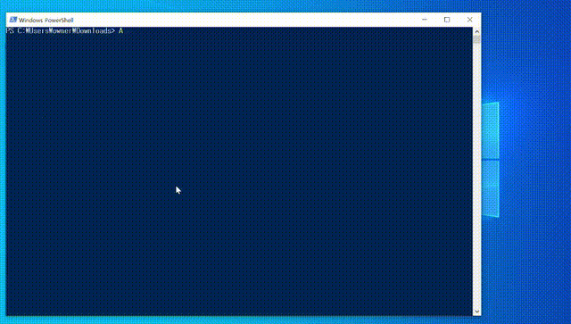

# Windows DLL Memory Scanner

This project implements a Windows DLL that provides memory scanning functionality similar to Cheat Engine. When loaded into another application, it opens a console window with an interactive command shell that allows you to scan, read, and modify memory.



## Project Structure

The project is organized into the following files:

- `module.go` - Main package, initialization code, and shared constants
- `memory_scanner.go` - Memory scanning functionality 
- `default_handler.go` - Basic command handler implementation
- `memory_scanner_handler.go` - Memory scanner command handler 
- `command_receiver.go` - Command line interface management

## Building on Windows

To build the DLL directly on Windows:

```bash
go build -buildmode=c-shared -o mymodule.dll
```

This will create a Windows DLL that can be loaded by any application. No additional tools are required as Go natively supports Windows APIs.

## Cross-compiling from Linux

To build a Windows DLL from Linux, you'll need to install the MinGW cross-compiler:

### Installing MinGW

For Debian/Ubuntu:
```bash
sudo apt-get install gcc-mingw-w64
```

For Fedora:
```bash
sudo dnf install mingw64-gcc
```

### Building the DLL

Once MinGW is installed, use the following command to cross-compile:

```bash
CC=x86_64-w64-mingw32-gcc \
GOOS=windows \
GOARCH=amd64 \
CGO_ENABLED=1 \
go build -buildmode=c-shared -o mymodule.dll
```

For Linux users using vim with gopls, you may need to export these variables to ensure they are available to the language server:

```bash
# Add to ~/.bashrc or ~/.profile
export CC=x86_64-w64-mingw32-gcc
export GOOS=windows
export GOARCH=amd64
export CGO_ENABLED=1
```

## Features

- Creates a console window when the DLL is loaded
- Provides an interactive command-line interface
- Memory scanning features similar to Cheat Engine:
  - Scan for specific values (int32, hex patterns)
  - Filter previous scan results
  - Wildcard support for hex pattern scanning using "??" notation
  - **Value change monitoring** (scan for values that changed, unchanged, increased, or decreased)
  - Read memory from specific addresses
  - Write values to memory
- **Multithreaded scanning** - Uses goroutines for faster memory scans
- Memory region enumeration and information
- Extensible command handler system

## Usage

1. Build the DLL using one of the methods above
2. Build and run the loader:
   ```bash
   cd loader
   go build
   ./loader.exe
   ```
3. A console window will open automatically
4. Use the interactive shell to issue commands

## Command Reference

### Basic Commands
- `help` - Display available commands
- `exit` - Exit the program
- `echo [text]` - Display the provided text
- `info` - Display process information

### Memory Scanner Commands
- `scan int32 [value]` - Scan memory for a 32-bit integer value
- `scan hex [pattern]` - Scan memory for a hex pattern (e.g., `scan hex FF??DE`)
  - Use `??` as wildcards in the pattern to match any byte
- `scan changed` - Find addresses whose values changed since last stored scan
- `scan unchanged` - Find addresses whose values didn't change
- `scan increased` - Find addresses whose values increased
- `scan decreased` - Find addresses whose values decreased
- `store` - Store current scan results for future value change comparisons
- `view [page_size]` - View current scan results with pagination (default page size: 10)
  - Use `n` for next page, `p` for previous page, `q` to quit viewing
  - Can enter page number directly to jump to that page
- `filter [value]` - Filter previous results for a new value
- `memory list` - List all readable memory regions
- `memory read [address] [length]` - Read memory at specified address
- `memory write [address] [type] [value]` - Write value to memory address
  - Types: int32, byte
